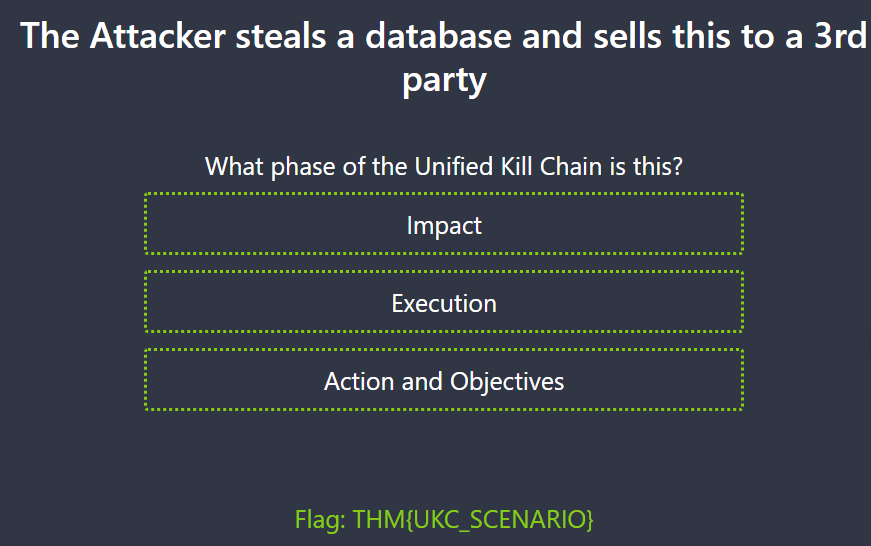

> # Unified Kill Chain

## Sumary
- [Sumary](#sumary)
  - [Task 2 - What is a "Kill Chain"](#task-2---what-is-a-kill-chain)
  - [Task 3 - What is "Threat Modelling"](#task-3---what-is-threat-modelling)
  - [Task 4 - Introducing the Unified Kill Chain](#task-4---introducing-the-unified-kill-chain)
  - [Task 5 - Phase: In (Initial Foothold)](#task-5---phase-in-initial-foothold)
  - [Task 6 - Phase: Through (Network Propagation)](#task-6---phase-through-network-propagation)
  - [Task 7 - Phase: Out (Action on Objectives)](#task-7---phase-out-action-on-objectives)
  - [Task 8 - Practical](#task-8---practical)

### Task 2 - What is a "Kill Chain"
1. Where does the term "Kill Chain" originate from? 
    > Originating from the military, a “Kill Chain” is a term used to explain the various stages of an attack.

    **Answer:** military

### Task 3 - What is "Threat Modelling"
1. What is the technical term for a piece of software or hardware in IT (Information Technology?) 
    > an asset in IT is a piece of software or hardware

    **Answer:** assets 

### Task 4 - Introducing the Unified Kill Chain
1. In what year was the Unified Kill Chain framework released? 
    **Answer:** 2017

1. According to the Unified Kill Chain, how many phases are there to an attack? 
    **Answer:** 18

1. What is the name of the attack phase where an attacker employs techniques to evade detection? 
    **Answer:** Defense Evasion

1. What is the name of the attack phase where an attacker employs techniques to remove data from a network? 
    **Answer:** Exfiltration

1. What is the name of the attack phase where an attacker achieves their objectives? 
    **Answer:** Objectives

### Task 5 - Phase: In (Initial Foothold)
1. What is an example of a tactic to gain a foothold using emails? 
    > Finding contact lists or lists of employees that can be impersonated or used in either a social engineering or phishing attack.

    **Answer:** Phishing

1. Impersonating an employee to request a password reset is a form of what? 
    > Calling or visiting the target and impersonating a user (for example, requesting a password reset) 

    **Answer:** Social Engineering

1. An adversary setting up the Command & Control server infrastructure is what phase of the Unified Kill Chain? 
    >  this could be setting up a command and control server, or a system capable of catching reverse shells and delivering payloads to the system.

    **Answer:** weaponization

1. Exploiting a vulnerability present on a system is what phase of the Unified Kill Chain? 
    **Answer:** Exploitation

1. Moving from one system to another is an example of? 
    **Anwser:** Pivoting

1. Leaving behind a malicious service that allows the adversary to log back into the target is what? 
    **Answer:** Persistence

### Task 6 - Phase: Through (Network Propagation)
1. As a SOC analyst, you pick up numerous alerts pointing to failed login attempts from an administrator account. What stage of the kill chain would an attacker be seeking to achieve? 
    **Answer:** Privilege Escalation

1. Mimikatz, a known post-exploitation tool, was recently detected running on the IT Manager’s computer. Security logs show that Mimikatz attempted to access memory spaces typically used by Windows to store user authentication secrets. Considering the usual capabilities and purpose of Mimikatz, what is the primary objective of this tool in such an attack scenario? 
    **Answer:** credential dumping

### Task 7 - Phase: Out (Action on Objectives)
1. While monitoring the network as a SOC analyst, you realise that there is a spike in the network activity, and all the traffic is outbound to an unknown IP address. What stage could describe this activity? 
    **Answer:** Exfiltration

1. Personally identifiable information (PII) has been released to the public by an adversary, and your organisation is facing scrutiny for the breach. What part of the CIA triad would be affected by this action? 
    **Answer:** Confidentiality

### Task 8 - Practical
1. Match the scenario prompt to the correct phase of the Unified Kill Chain to reveal the flag at the end. What is the flag? 
     
    **Answer:** THM{UKC_SCENARIO}
