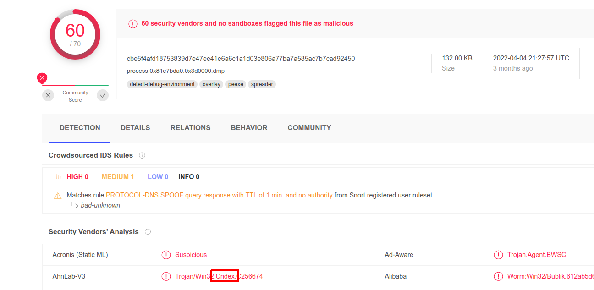

# Table of Contents 

## Task 2 - Obtaining Memory Samples
1. What memory format is the most common?<br>
**Answer:** .raw

2. The Window's system we're looking to perform memory forensics on was turned off by mistake. What file contains a compressed memory image?<br>
**Answer:** hiberfil.sys

3. How about if we wanted to perform memory forensics on a VMware-based virtual machine?<br>
**Answer:** .vmem

## Task 3 - Examining Our Patient
1. Running the imageinfo command in Volatility will provide us with a number of profiles we can test with, however, only one will be correct. We can test these profiles using the pslist command, validating our profile selection by the sheer number of returned results. Do this now with the command `volatility -f MEMORY_FILE.raw --profile=PROFILE pslist`. What profile is correct for this memory image?<br>
**Answer:** WinXPSP2x86

2. Take a look through the processes within our image. What is the process ID for the smss.exe process? If results are scrolling off-screen, try piping your output into less<br>
Use `pslist` plugin.
```sh
$ vol.py -f cridex.vmem --profile=WinXPSP2x86 pslist | grep smss.exe
Volatility Foundation Volatility Framework 2.6.1
0x822f1020 smss.exe                368      4      3       19 ------      0 2012-07-22 02:42:31 UTC+0000
```
**Answer:** 368

3. It's fairly common for malware to attempt to hide itself and the process associated with it. That being said, we can view intentionally hidden processes via the command `psxview`. What process has only one 'False' listed?<br>
```sh
$ vol.py -f cridex.vmem --profile=WinXPSP2x86 psxview
Volatility Foundation Volatility Framework 2.6.1
Offset(P)  Name                    PID pslist psscan thrdproc pspcid csrss session deskthrd ExitTime
---------- -------------------- ------ ------ ------ -------- ------ ----- ------- -------- --------
0x02498700 winlogon.exe            608 True   True   True     True   True  True    True     
0x02511360 svchost.exe             824 True   True   True     True   True  True    True     
0x022e8da0 alg.exe                 788 True   True   True     True   True  True    True     
0x020b17b8 spoolsv.exe            1512 True   True   True     True   True  True    True     
0x0202ab28 services.exe            652 True   True   True     True   True  True    True     
0x02495650 svchost.exe            1220 True   True   True     True   True  True    True     
0x0207bda0 reader_sl.exe          1640 True   True   True     True   True  True    True     
0x025001d0 svchost.exe            1004 True   True   True     True   True  True    True     
0x02029ab8 svchost.exe             908 True   True   True     True   True  True    True     
0x023fcda0 wuauclt.exe            1136 True   True   True     True   True  True    True     
0x0225bda0 wuauclt.exe            1588 True   True   True     True   True  True    True     
0x0202a3b8 lsass.exe               664 True   True   True     True   True  True    True     
0x023dea70 explorer.exe           1484 True   True   True     True   True  True    True     
0x023dfda0 svchost.exe            1056 True   True   True     True   True  True    True     
0x024f1020 smss.exe                368 True   True   True     True   False False   False    
0x025c89c8 System                    4 True   True   True     True   False False   False    
0x024a0598 csrss.exe               584 True   True   True     True   False True    True 
```
**Answer:** csrss.exe

4. In addition to viewing hidden processes via psxview, we can also check this with a greater focus via the command 'ldrmodules'. Three columns will appear here in the middle, InLoad, InInit, InMem. If any of these are false, that module has likely been injected which is a really bad thing. On a normal system the grep statement above should return no output. Which process has all three columns listed as 'False' (other than System)?<br>
```sh
$ vol.py -f cridex.vmem --profile=WinXPSP2x86 ldrmodules | head
Volatility Foundation Volatility Framework 2.6.1
Pid      Process              Base       InLoad InInit InMem MappedPath
-------- -------------------- ---------- ------ ------ ----- ----------
       4 System               0x7c900000 False  False  False \WINDOWS\system32\ntdll.dll
     368 smss.exe             0x48580000 True   False  True  \WINDOWS\system32\smss.exe
     368 smss.exe             0x7c900000 True   True   True  \WINDOWS\system32\ntdll.dll
     584 csrss.exe            0x00460000 False  False  False \WINDOWS\Fonts\vgasys.fon
     584 csrss.exe            0x4a680000 True   False  True  \WINDOWS\system32\csrss.exe
     584 csrss.exe            0x75b40000 True   True   True  \WINDOWS\system32\csrsrv.dll
     584 csrss.exe            0x75b50000 True   True   True  \WINDOWS\system32\basesrv.dll
     584 csrss.exe            0x7e720000 True   True   True  \WINDOWS\system32\sxs.dll
```
**Answer:** csrss.exe

5. Injected code can be a huge issue and is highly indicative of very very bad things. We can check for this with the command `malfind`. Using the full command `volatility -f MEMORY_FILE.raw --profile=PROFILE malfind -D <Destination Directory>` we can not only find this code, but also dump it to our specified directory. Let's do this now! We'll use this dump later for more analysis. How many files does this generate?<br>
```sh
$ vol.py -f cridex.vmem --profile=WinXPSP2x86 malfind | grep ".exe" | wc -l
Volatility Foundation Volatility Framework 2.6.1
12
```
**Answer:** 12

6. Now that we've seen all of the DLLs running in memory, let's go a step further and pull them out! Do this now with the command `volatility -f MEMORY_FILE.raw --profile=PROFILE --pid=PID dlldump -D <Destination Directory>` where the PID is the process ID of the infected process we identified earlier (questions five and six). How many DLLs does this end up pulling?<br>
pid = 584 from Q5 & 6<br>
```sh
$ vol.py -f cridex.vmem --profile=WinXPSP2x86 dlldump --pid=584 -D /tmp/volatility/dll/
Volatility Foundation Volatility Framework 2.6.1
Process(V) Name                 Module Base Module Name          Result
---------- -------------------- ----------- -------------------- ------
0x822a0598 csrss.exe            0x04a680000 csrss.exe            OK: module.584.24a0598.4a680000.dll
0x822a0598 csrss.exe            0x07c900000 ntdll.dll            OK: module.584.24a0598.7c900000.dll
0x822a0598 csrss.exe            0x075b40000 CSRSRV.dll           OK: module.584.24a0598.75b40000.dll
0x822a0598 csrss.exe            0x077f10000 GDI32.dll            OK: module.584.24a0598.77f10000.dll
0x822a0598 csrss.exe            0x07e720000 sxs.dll              OK: module.584.24a0598.7e720000.dll
0x822a0598 csrss.exe            0x077e70000 RPCRT4.dll           OK: module.584.24a0598.77e70000.dll
0x822a0598 csrss.exe            0x077dd0000 ADVAPI32.dll         OK: module.584.24a0598.77dd0000.dll
0x822a0598 csrss.exe            0x077fe0000 Secur32.dll          OK: module.584.24a0598.77fe0000.dll
0x822a0598 csrss.exe            0x075b50000 basesrv.dll          OK: module.584.24a0598.75b50000.dll
0x822a0598 csrss.exe            0x07c800000 KERNEL32.dll         OK: module.584.24a0598.7c800000.dll
0x822a0598 csrss.exe            0x07e410000 USER32.dll           OK: module.584.24a0598.7e410000.dll
0x822a0598 csrss.exe            0x075b60000 winsrv.dll           OK: module.584.24a0598.75b60000.dll

$ ls /tmp/volatility/dll/ | wc -l
12
```
**Answer:** 12

## Task 4 - Post Actions
What malware has our sample been infected with? You can find this in the results of VirusTotal and Hybrid Anaylsis. <br>
<br>
**Answer:** Cridex
