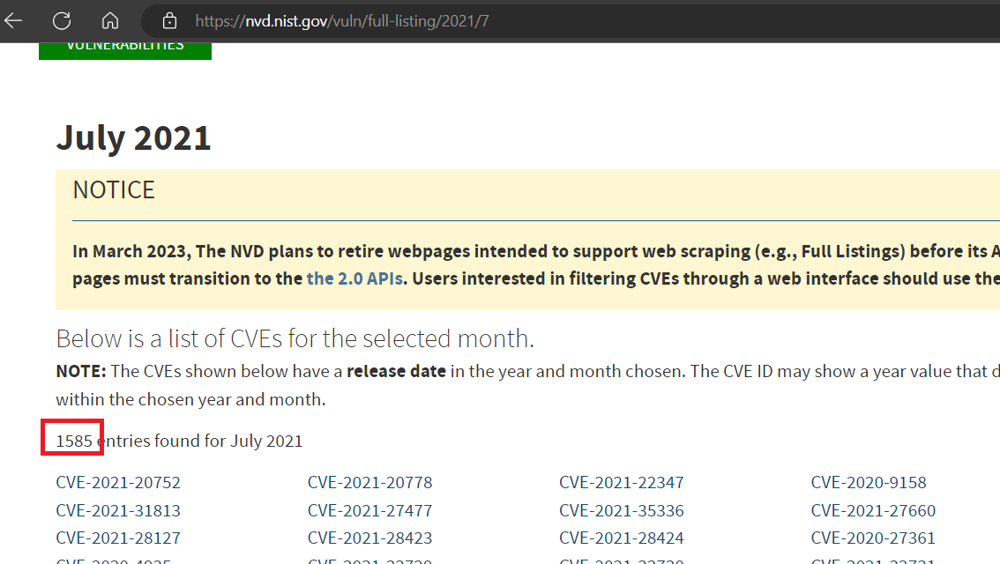
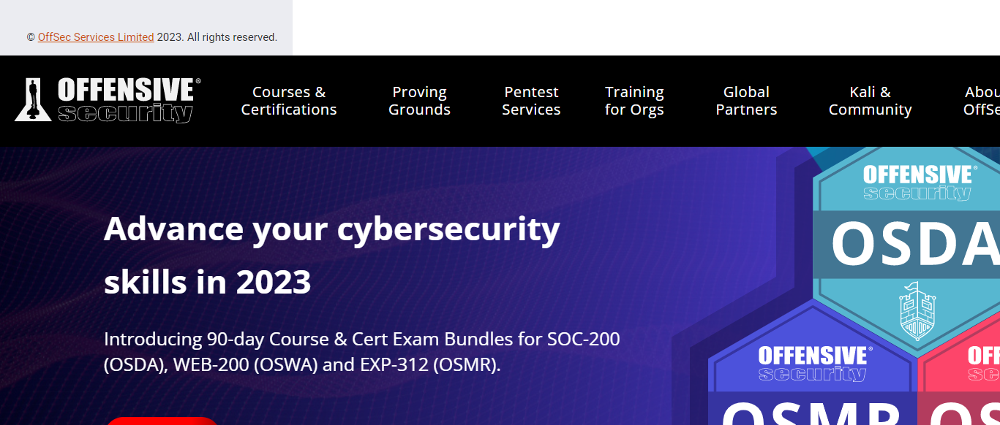

> # Vulnerabilities 101

# Summary
<!-- TOC -->

- [Summary](#summary)
    - [Task 2 - Introduction to Vulnerabilities](#task-2---introduction-to-vulnerabilities)
    - [Task 3 - Scoring Vulnerabilities (CVSS & VPR)](#task-3---scoring-vulnerabilities-cvss--vpr)
    - [Task 4 - Vulnerability Databases](#task-4---vulnerability-databases)
    - [Task 5 - An Example of Finding a Vulnerability](#task-5---an-example-of-finding-a-vulnerability)
    - [Task 6 - Showcase: Exploiting Ackme's Application](#task-6---showcase-exploiting-ackmes-application)

<!-- /TOC -->

## Task 2 - Introduction to Vulnerabilities
1. An attacker has been able to upgrade the permissions of their system account from "user" to "administrator". What type of vulnerability is this? 
    > Operating System: These types of vulnerabilities are found within Operating Systems (OSs) and often result in privilege escalation.

    **Answer:** Operating System

1. You manage to bypass a login panel using cookies to authenticate. What type of vulnerability is this? 
    > Application Logic: These vulnerabilities are a result of poorly designed applications. For example, poorly implemented authentication mechanisms that may result in an attacker being able to impersonate a user.
    **Answer:** Application Logic

## Task 3 - Scoring Vulnerabilities (CVSS & VPR)
1. What year was the first iteration of CVSS published? 
    **Answer:** 2005

1. If you wanted to assess vulnerability based on the risk it poses to an organisation, what framework would you use? 
    **Answer:** VPR

1. If you wanted to use a framework that was free and open-source, what framework would that be? 
    **Answer:** CVSS

## Task 4 - Vulnerability Databases
1. Using NVD, how many CVEs were submitted in July 2021? 
     
    **Answer:** 1585

1. Who is the author of Exploit-DB? 
     
    **Answer:** Offensive Security

## Task 5 - An Example of Finding a Vulnerability
1. What type of vulnerability did we use to find the name and version of the application in this example? 
    > in this task, we will leverage the “Version Disclosure” vulnerability to find out the version of an application

    **Answer:** Version Disclosure

## Task 6 - Showcase: Exploiting Ackme's Application
1. Follow along with the showcase of exploiting ACKme's application to the end to retrieve a flag. What is this flag? 
    **Answer:** THM{ACKME_ENGAGEMENT}

