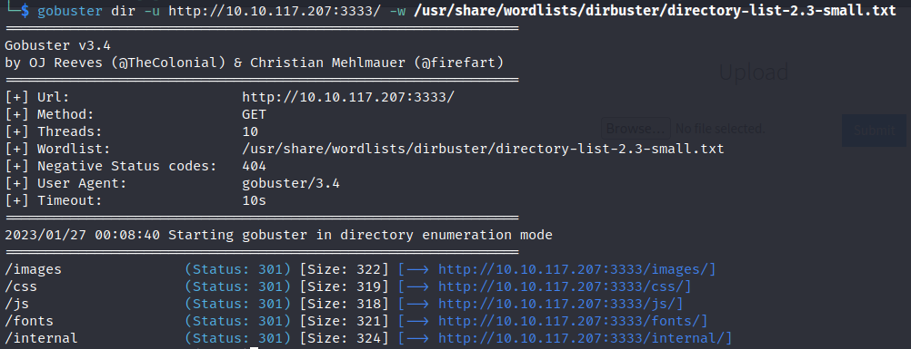
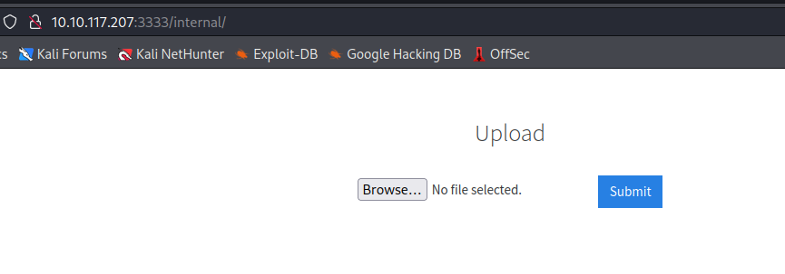
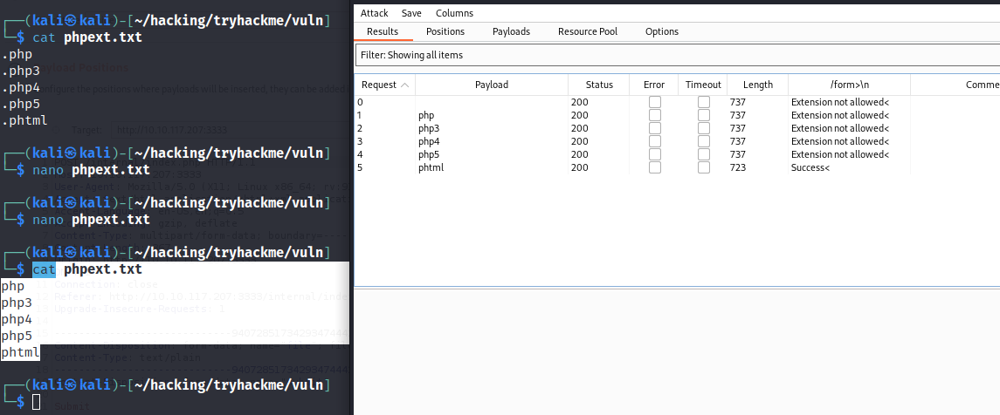
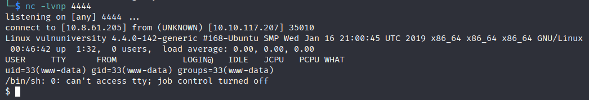
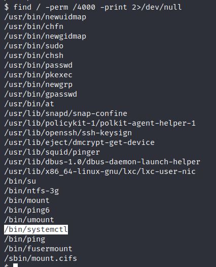
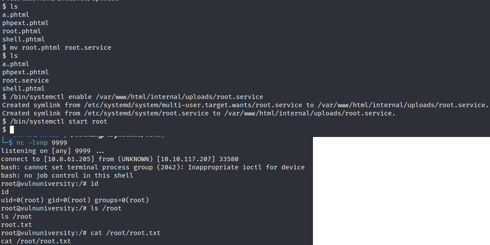

> # Vulnversity

# Summary
<!-- TOC -->

- [Summary](#summary)
    - [Task 2 - Reconnaissance](#task-2---reconnaissance)
    - [Task 3 - Locating directories using GoBuster](#task-3---locating-directories-using-gobuster)
    - [Task 4 - Compromise the webserver](#task-4---compromise-the-webserver)
    - [Task 5 - Privilege Escalation](#task-5---privilege-escalation)
- [Reference](#reference)

<!-- /TOC -->

## Task 2 - Reconnaissance
Scan the box with `nmap -Pn -A`
```
sudo nmap -Pn 10.10.117.207 -A  
[sudo] password for kali: 
Starting Nmap 7.92 ( https://nmap.org ) at 2023-01-26 23:16 EST
Nmap scan report for 10.10.117.207
Host is up (0.21s latency).
Not shown: 994 closed tcp ports (reset)
PORT     STATE SERVICE     VERSION
21/tcp   open  ftp         vsftpd 3.0.3
22/tcp   open  ssh         OpenSSH 7.2p2 Ubuntu 4ubuntu2.7 (Ubuntu Linux; protocol 2.0)
| ssh-hostkey: 
|   2048 5a:4f:fc:b8:c8:76:1c:b5:85:1c:ac:b2:86:41:1c:5a (RSA)
|   256 ac:9d:ec:44:61:0c:28:85:00:88:e9:68:e9:d0:cb:3d (ECDSA)
|_  256 30:50:cb:70:5a:86:57:22:cb:52:d9:36:34:dc:a5:58 (ED25519)
139/tcp  open  netbios-ssn Samba smbd 3.X - 4.X (workgroup: WORKGROUP)
445/tcp  open  netbios-ssn Samba smbd 4.3.11-Ubuntu (workgroup: WORKGROUP)
3128/tcp open  http-proxy  Squid http proxy 3.5.12
|_http-server-header: squid/3.5.12
|_http-title: ERROR: The requested URL could not be retrieved
3333/tcp open  http        Apache httpd 2.4.18 ((Ubuntu))
|_http-server-header: Apache/2.4.18 (Ubuntu)
|_http-title: Vuln University
Device type: general purpose
Running: Linux 5.X
OS CPE: cpe:/o:linux:linux_kernel:5.4
OS details: Linux 5.4
Network Distance: 2 hops
Service Info: Host: VULNUNIVERSITY; OSs: Unix, Linux; CPE: cpe:/o:linux:linux_kernel

Host script results:
| smb-os-discovery: 
|   OS: Windows 6.1 (Samba 4.3.11-Ubuntu)
|   Computer name: vulnuniversity
|   NetBIOS computer name: VULNUNIVERSITY\x00
|   Domain name: \x00
|   FQDN: vulnuniversity
|_  System time: 2023-01-26T23:17:22-05:00
| smb-security-mode: 
|   account_used: guest
|   authentication_level: user
|   challenge_response: supported
|_  message_signing: disabled (dangerous, but default)
|_clock-skew: mean: 1h40m17s, deviation: 2h53m12s, median: 16s
| smb2-security-mode: 
|   3.1.1: 
|_    Message signing enabled but not required
|_nbstat: NetBIOS name: VULNUNIVERSITY, NetBIOS user: <unknown>, NetBIOS MAC: <unknown> (unknown)
| smb2-time: 
|   date: 2023-01-27T04:17:22
|_  start_date: N/A

```
1. Scan the box, how many ports are open?<br>
    **Answer:** 6

1. What version of the squid proxy is running on the machine?<br>
    **Answer:** 3.5.12

1. How many ports will nmap scan if the flag -p-400 was used?<br>
    Nmap will scan from port 1 to 400.<br>
    **Answer:** 400

1. Using the nmap flag -n what will it not resolve?<br>
    > -n/-R: Never do DNS resolution/Always resolve [default: sometimes]

    **Answer:** DNS

1. What is the most likely operating system this machine is running?<br>
    **Answer:** Ubuntu

1. What port is the web server running on?<br>
    **Answer:** 3333

## Task 3 - Locating directories using GoBuster
1. What is the directory that has an upload form page?<br>
    Use `gobuster` and small_list to find hidden directory.<br>
    <br>
    Path to `internal` has an upload form.<br>
    <br>
    **Answer:** /internal/

## Task 4 - Compromise the webserver
1. What common file type, which you'd want to upload to exploit the server, is blocked? Try a couple to find out.<br>
    The webser is running Apache2 (LAMP), we can use .php to exploit the server.<br>
    **Answer:** .php

1. Run this attack, what extension is allowed?<br>
    Create lists without dot prefix then follow steps on description.<br>
    <br>
    **Answer:** .phtml

1. What is the name of the user who manages the webserver?<br>
    Upload the shell, then GET this file to trigger the reverse shell.<br>
    <br>
    List `/home` folder to find the user.<br>
    ```
    $ ls /home
    bill
    ```
    **Answer:** bill

1. What is the user flag?<br>
    Read user flag in `/home/bill/user.txt`.<br>
    <!-- 8bd7992fbe8a6ad22a63361004cfcedb -->
    **Answer:** \<redacted>

## Task 5 - Privilege Escalation
1. On the system, search for all SUID files. What file stands out?<br>
    Find binary have SUID permission with `find` command.<br>
    <br>
    **Answer:** /bin/systemctl

1. Become root and get the last flag (/root/root.txt)<br>
    Follow this [link](https://gist.github.com/A1vinSmith/78786df7899a840ec43c5ddecb6a4740), change your Kali's IP and port. You can upload the `root.service` via `/internal/uploads`, it will locate in `/var/www/html/internal/uploads`.<br>
    On port 9999, you will receive a connection as root user, then cat the flag.<br>
    
    <!-- a58ff8579f0a9270368d33a9966c7fd5 -->
    **Answer:** \<redacted>

# Reference
* https://gist.github.com/A1vinSmith/78786df7899a840ec43c5ddecb6a4740
* https://www.tecmint.com/how-to-find-files-with-suid-and-sgid-permissions-in-linux/
