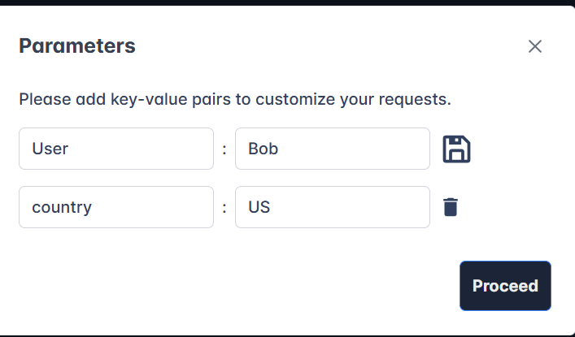

> # Web Application Basics

## Summary 
- [Summary](#summary)
  - [Task 2 - Web Application Overview](#task-2---web-application-overview)
  - [Task 3 - Uniform Resource Locator](#task-3---uniform-resource-locator)
  - [Task 4 - HTTP Messages](#task-4---http-messages)
  - [Task 5 - HTTP Request: Request Line and Methods](#task-5---http-request-request-line-and-methods)
  - [Task 6 - HTTP Request: Headers and Body](#task-6---http-request-headers-and-body)
  - [Task 7 - HTTP Response: Status Line and Status Codes](#task-7---http-response-status-line-and-status-codes)
  - [Task 8 - HTTP Response: Headers and Body](#task-8---http-response-headers-and-body)
  - [Task 9 - Security Headers](#task-9---security-headers)
  - [Task 10 - Practical Task: Making HTTP Requests](#task-10---practical-task-making-http-requests)

### Task 2 - Web Application Overview
1. Which component on a computer is responsible for hosting and delivering content for web applications? 
    Web Server is the component responsibled for hosting and delivering content for web applications
    **Answer:** Web Server

1. Which tool is used to access and interact with web applications? 
    **Answer:** web browser

1. Which component acts as a protective layer, filtering incoming traffic to block malicious attacks, and ensuring the security of the the web application? 
    > WAF (Web Application Firewall) is an optional component for web applications. It helps filter out dangerous requests away from the Web Server and provides an element of protection.

    **Answer:** Web Application Firewall

### Task 3 - Uniform Resource Locator
1. Which protocol provides encrypted communication to ensure secure data transmission between a web browser and a web server? 
    > HTTPS is more secure because it encrypts the connection, which is why browsers and cyber security experts recommend it.

    **Answer:** HTTPS

1. What term describes the practice of registering domain names that are misspelt variations of popular websites to exploit user errors and potentially engage in fraudulent activities? 
    > From a security standpoint, look for domain names that appear almost like real ones but have small differences (this is called typosquatting).

    **Answer:** typosquatting

1. What part of a URL is used to pass additional information, such as search terms or form inputs, to the web server? 
    > The query string is the part of the URL that starts with a question mark (?). It’s often used for things like search terms or form inputs. Since users can modify these query strings

    **Answer:** Query String

### Task 4 - HTTP Messages
1. Which HTTP message is returned by the web server after processing a client's request? 
    > HTTP Responses: Sent by the server in response to the user’s request.

    **Answer:** HTTP Response

1. What follows the headers in an HTTP message? 
    **Answer:** Empty Line

### Task 5 - HTTP Request: Request Line and Methods
1. Which HTTP protocol version became widely adopted and remains the most commonly used version for web communication, known for introducing features like persistent connections and chunked transfer encoding? 
    > HTTP/1.1 (1997) Brought persistent connections, chunked transfer encoding, and better caching. It’s still widely used today.

    **Answer:** HTTP/1.1

1. Which HTTP request method describes the communication options for the target resource, allowing clients to determine which HTTP methods are supported by the web server? 
    > OPTIONS: Tells you what methods are available for a specific resource, helping clients understand what they can do with the server.

    **Answer:** OPTIONS

1. In an HTTP request, which component specifies the specific resource or endpoint on the web server that the client is requesting, typically appearing after the domain name in the URL? 
    > The URL path tells the server where to find the resource the user is asking for.

    **Answer:** URL Path

### Task 6 - HTTP Request: Headers and Body
1. Which HTTP request header specifies the domain name of the web server to which the request is being sent? 
    > Host: Specifies the name of the web server the request is for.

    **Answer:** Host

1. What is the default content type for form submissions in an HTTP request where the data is encoded as key=value pairs in a query string format? 
    > URL Encoded (application/x-www-form-urlencoded) A format where data is structured in pairs of key and value where (key=value)

    **Answer:** application/x-www-form-urlencoded

1. Which part of an HTTP request contains additional information like host, user agent, and content type, guiding how the web server should process the request? 
    **Answer:** Request Headers

### Task 7 - HTTP Response: Status Line and Status Codes
1. What part of an HTTP response provides the HTTP version, status code, and a brief explanation of the response's outcome? 
    > The first line in every HTTP response is called the Status Line. It gives you three key pieces of info: HTTP Version: This tells you which version of HTTP is being used. Status Code: A three-digit number showing the outcome of your request. Reason Phrase: A short message explaining the status code in human-readable terms.

    **Answer:** Status Line

1. Which category of HTTP response codes indicates that the web server encountered an internal issue or is unable to fulfil the client's request? 
    > Server Error Responses (500-599) These codes mean the server encountered an error while trying to fulfil the request. These are usually server-side issues and not the client’s fault.

    **Answer:** Server Error Responses

1. Which HTTP status code indicates that the requested resource could not be found on the web server? 
    > 404 (Not Found) The server couldn’t find the resource at the given URL. 

    **Answer:** 404

### Task 8 - HTTP Response: Headers and Body
1. Which HTTP response header can reveal information about the web server's software and version, potentially exposing it to security risks if not removed? 
    > Server: This header shows what kind of server software is handling the request. It’s good for debugging, but it can also reveal server information that might be useful for attackers, so many people remove or obscure this one.

    **Answer:** Server

1. Which flag should be added to cookies in the Set-Cookie HTTP response header to ensure they are only transmitted over HTTPS, protecting them from being exposed during unencrypted transmissions? 
    > Set-Cookie: This one sends cookies from the server to the client, which the client then stores and sends back with future requests. To keep things secure, make sure cookies are set with the HttpOnly flag (so they can’t be accessed by JavaScript) and the Secure flag (so they’re only sent over HTTPS).

    **Answer:** Secure

1. Which flag should be added to cookies in the Set-Cookie HTTP response header to prevent them from being accessed via JavaScript, thereby enhancing security against XSS attacks? 
    **Answer:** HttpOnly

### Task 9 - Security Headers
1. In a Content Security Policy (CSP) configuration, which property can be set to define where scripts can be loaded from? 
    > script-src - which specifics the policy for where scripts can be loaded from, which is self along with scripts hosted on https://cdn.tryhackme.com

    **Answer:** script-src

1. When configuring the Strict-Transport-Security (HSTS) header to ensure that all subdomains of a site also use HTTPS, which directive should be included to apply the security policy to both the main domain and its subdomains? 
    > includeSubDomains - An optional setting that instructs the browser to also apply this setting to all subdomains.

    **Answer:** includeSubDomains

1. Which HTTP header directive is used to prevent browsers from interpreting files as a different MIME type than what is specified by the server, thereby mitigating content type sniffing attacks? 
    > nosniff - This directive instructs the browser not to sniff or guess the MIME type.

    **Answer:** nosniff

### Task 10 - Practical Task: Making HTTP Requests
1. Make a GET request to /api/users. What is the flag? 
    **Answer:** THM{YOU_HAVE_JUST_FOUND_THE_USER_LIST}

1. Make a POST request to /api/user/2 and update the country of Bob from UK to US. What is the flag? 
    We need to put two parameters to the request. 
     
    **Answer:** THM{YOU_HAVE_MODIFIED_THE_USER_DATA}

1. Make a DELETE request to /api/user/1 to delete the user. What is the flag? 
    **Answer:** THM{YOU_HAVE_JUST_DELETED_A_USER}
