> # Windows Forensics 1

# Summary 
<!-- TOC -->

- [Summary](#summary)
    - [Task 1 - Introduction to Windows Forensics](#task-1---introduction-to-windows-forensics)
    - [Task 2 - Windows Registry and Forensics](#task-2---windows-registry-and-forensics)
    - [Task 3 - Accessing registry hives offline](#task-3---accessing-registry-hives-offline)
    - [Task 6 - System Information and System Accounts](#task-6---system-information-and-system-accounts)
    - [Task 7 - Usage or knowledge of files/folders](#task-7---usage-or-knowledge-of-filesfolders)
    - [Task 8 - Evidence of Execution](#task-8---evidence-of-execution)
    - [Task 9 - External Devices/USB device forensics](#task-9---external-devicesusb-device-forensics)
    - [Task 10 - Hands-on Challenge](#task-10---hands-on-challenge)

<!-- /TOC -->

## Task 1 - Introduction to Windows Forensics
1. What is the most used Desktop Operating System right now? 
    > Microsoft Windows is by large the most used Desktop Operating System right now. 

    **Answer:** Microsoft Windows

## Task 2 - Windows Registry and Forensics
1. What is the short form for HKEY_LOCAL_MACHINE? 
    **Answer: ** HKLM

## Task 3 - Accessing registry hives offline
Locations where registry are stored on disk. 
The majority of these hives are located in the C:\Windows\System32\Config directory and are: 
* DEFAULT (mounted on HKEY_USERS\DEFAULT)
* SAM (mounted on HKEY_LOCAL_MACHINE\SAM)
* SECURITY (mounted on HKEY_LOCAL_MACHINE\Security)
* SOFTWARE (mounted on HKEY_LOCAL_MACHINE\Software)
* SYSTEM (mounted on HKEY_LOCAL_MACHINE\System)

For Windows 7 and above, a user’s profile directory is located in C:\Users\\\<username>\ where the hives are: 
* NTUSER.DAT (mounted on HKEY_CURRENT_USER when a user logs in)
* USRCLASS.DAT (mounted on HKEY_CURRENT_USER\Software\CLASSES)

The USRCLASS.DAT hive is located in the directory C:\Users\\\<username>\AppData\Local\Microsoft\Windows.  

C:\Windows\AppCompat\Programs\Amcache.hve. Windows creates this hive to save information on programs that were recently run on the system.

1. What is the path for the five main registry hives, DEFAULT, SAM, SECURITY, SOFTWARE, and SYSTEM? 
    **Answer:** C:\Windows\System32\config

1. What is the path for the AmCache hive? 
    **Answer:** C:\Windows\appcompat\Programs\Amcache.hve

## Task 6 - System Information and System Accounts
1. What is the Current Build Number of the machine whose data is being investigated? 
    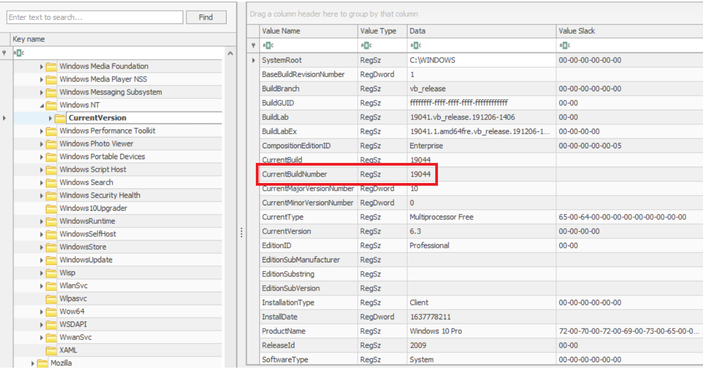 
    **Answer:** 19044

1. Which ControlSet contains the last known good configuration? 
    **Answer:** 1

1. What is the Computer Name of the computer? 
    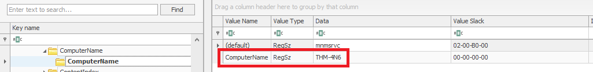 
    **Answer:** THM-4N6

1. What is the value of the TimeZoneKeyName? 
    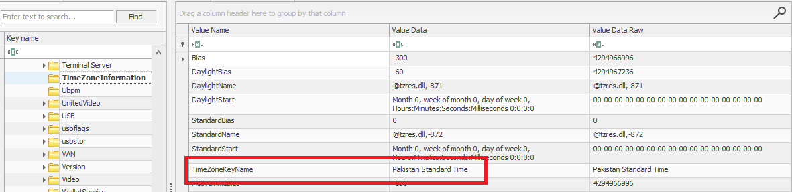 
    **Answer:** Pakistan Standard Time

1. What is the DHCP IP address? 
    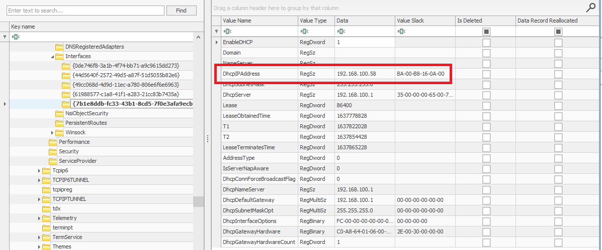 
    **Answer:** 192.168.100.58

1. What is the RID of the Guest User account? 
    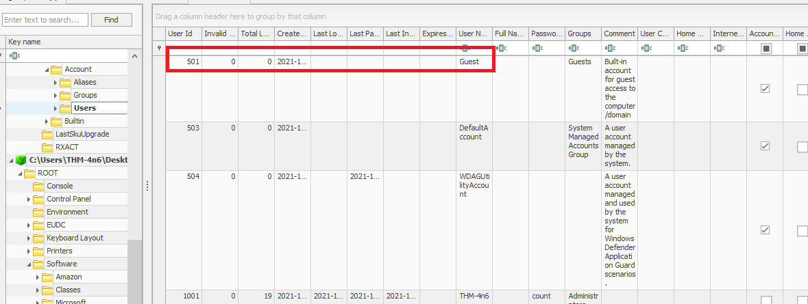 
    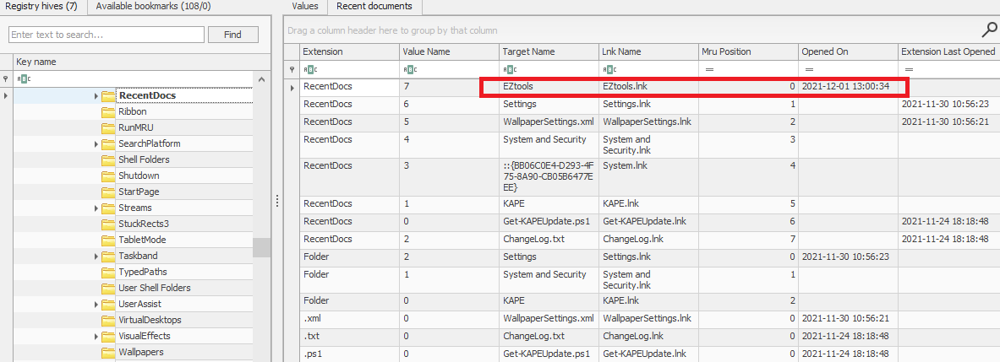 
    **Answer:** 2021-12-01 13:00:34

1. At what time was My Computer last interacted with? 
    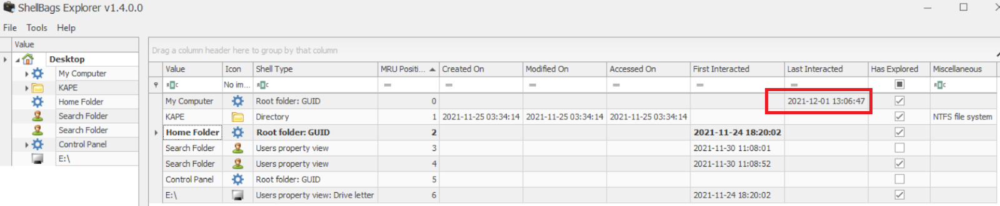 
    **Answer:** 2021-12-01 13:06:47

1. What is the Absolute Path of the file opened using notepad.exe? 
    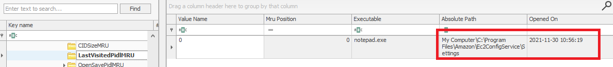 
    **Answer:** C:\Program Files\Amazon\Ec2ConfigService\Settings

1. When was this file opened?     
    **Answer:** 2021-11-30 10:56:19

## Task 8 - Evidence of Execution
1. How many times was the File Explorer launched? 
    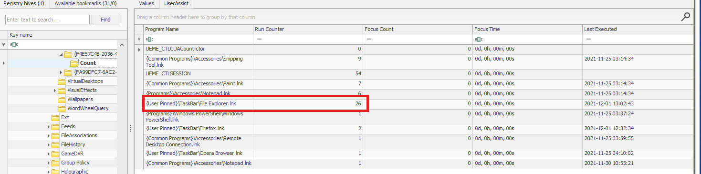 
    **Answer:** 26

1. What is another name for ShimCache? 
    > It is also called Application Compatibility Cache (AppCompatCache).

    **Answer:** AppCompatCache

1. Which of the artifacts also saves SHA1 hashes of the executed programs? 
    > This performs a similar function to ShimCache, and stores additional data related to program executions. This data includes execution path, installation, execution and deletion times, and SHA1 hashes of the executed programs. 

    **Answer:** AmCache

1. Which of the artifacts saves the full path of the executed programs? 
    **Answer:** BAM/DAM

## Task 9 - External Devices/USB device forensics
1. What is the serial number of the device from the manufacturer 'Kingston'? 
    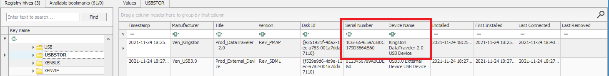 
    **Answer:** 1C6F654E59A3B0C179D366AE&O

1. What is the name of this device? 
    **Answer:** Kingston DataTraveler 2.0 USB Device

1. What is the friendly name of the device from the manufacturer 'Kingston'? 
    **Answer:** USB

## Task 10 - Hands-on Challenge
1. How many user created accounts are present on the system?  
    Use RegistryExplorer to load `C:\Windows\System32\config\SAM` file, under User you will see three created accounts on system. 
    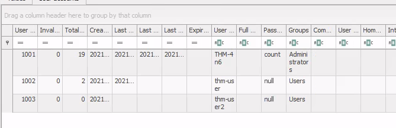 
    **Answer:** 3

1. What is the username of the account that has never been logged in? 
    Account thm-user2 doesn't have value on **Last Logon Time**. 
    **Answer:** thm-user2

1. What's the password hint for the user THM-4n6? 
    Under the **Password hint** filed. 
    **Answer:** count

1. When was the file 'Changelog.txt' accessed? 
    Load NTUSER.DAT and follow this path `NTUSER.DAT\Software\Microsoft\Windows\CurrentVersion\Explorer\RecentDocs`. 
     
    **Answer:** 2021-11-24 18:18:48

1. What is the complete path from where the python 3.8.2 installer was run?  
    Load NTUSER.DAT and follow `SOFTWARE\Microsoft\Windows\CurrentVersion\Explorer\UserAssist\{CEBFF5CD-ACE2-4F4F-9178-9926F41749EA}\Count` then search for string `python`. 
    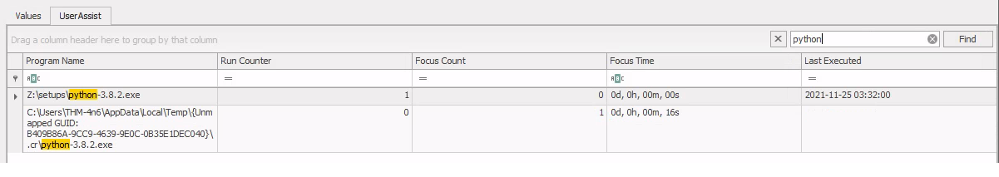 
    **Answer:** Z:\setups\python-3.8.2.exe

1. When was the USB device with the friendly name 'USB' last connected? 
    Load SYSTEM hive and navigate to `ControlSet001\Enum\USBTOR`. 
    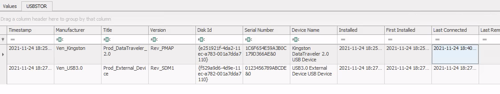 
    **Answer:** 2021-11-24 18:40:06
