> # Windows Incident Surface

# Summary
- [Summary](#summary)
  - [Task 4 - Reliability of the System Tools](#task-4---reliability-of-the-system-tools)
  - [Task 5 - System Profile](#task-5---system-profile)
  - [Task 6 - Users and Sessions](#task-6---users-and-sessions)
  - [Task 7 - Network Scope](#task-7---network-scope)
  - [Task 8 - Background Activities I: Startup and Registry](#task-8---background-activities-i-startup-and-registry)
  - [Task 9 - Background Activities II: Services and Scheduled Items](#task-9---background-activities-ii-services-and-scheduled-items)
  - [Task 10 - Background Activities III: Processes and Directories](#task-10---background-activities-iii-processes-and-directories)


##  Task 4 - Reliability of the System Tools
1. What tool did the adversary use to delete the logs?<br>
    Follow all command given by documents, the file `ps_profile_dump.txt` contains all command attacker type on PowerShell. To detele event log, the attacker use built-in tool `wevtutil`.<br>
    ```powershell
    Set-PSReadlineOption -HistorySaveStyle SaveNothing
    Remove-Item (Get-PSReadlineOption).HistorySavePath -ErrorAction SilentlyContinue
    Write-Host "Less Murphy Ventures  Co. Ps-History-Shredder Profile" -ForegroundColor Green
    Write-Host "Loading Secure Console" -ForegroundColor Green
    wevtutil el | ForEach-Object {wevtutil cl $_}; Stop-Service -Name "eventlog" -Force
    New-ItemProperty -Path "HKLM:\SYSTEM\CurrentControlSet\Control\SecurityProviders\WDigest" -Name "UseLogonCredential" -Value 1 -PropertyType DWORD -Force
    Set-Location "$Env:UserProfile\Desktop"
    ```
    **Answer:** wevtutil

2. What was the registry path used by the adversary to store and steal the login credentials?<br>
    From the above, the attacker had set the `UseLogonCredential` key to save cleartext password in memory.<br>
    **Answer:** HKLM:\SYSTEM\CurrentControlSet\Control\SecurityProviders\WDigest

##  Task 5 - System Profile
1. What is the hostname of the compromised host?<br>
    File `sysinfo.txt` will hep us.<br>
    ```
    CSName         : CCTL-WS-018-B21
    Version        : 10.0.17763
    BuildNumber    : 17763
    InstallDate    : 3/17/2021 5:59:06 PM
    LastBootUpTime : 6/29/2024 4:28:49 PM
    OSArchitecture : 64-bit
    ```
    **Answer:** CCTL-WS-018-B21

2. What is the OS version of the compromised host?<br>
    **Answer:** 10.0.17763

3. What is the Time ID of the compromised host?<br>
   File `systime.txt`.<br>
   **Answer:** Turkey Standard Time

##  Task 6 - Users and Sessions
1. What is the total number of suspicious accounts?<br>
    File `l-users.txt`
    ```
    Name               Enabled Description                                                                                 
    ----               ------- -----------                                                                                 
    ADMIN-SRV          True    Trusted admin account of LMV Co. for administering the *-SRV and CCTL-* zones.              
    Administrator      True    Built-in account for administering the computer                                             
    Adminstrator       True    Built-in account for administering the computer                                             
    DefaultAccount     False   A user account managed by the system.                                                       
    Guest              True    Built-in account for guest access to the computer                                           
    WDAGUtilityAccount False   A user account managed and used by the system for Windows Defender Application Guard scen...
    ```
    There are four accounts enabled on the system. But only `Administrator` is enabled by default; others must be investigated further.<br>
    **Answer:** 3
1. What is the security identifier (SID) of the Guest account?<br>
    File `usr-guest.txt`.<br>
    ```
    AccountExpires         : 
    Description            : Built-in account for guest access to the computer
    Enabled                : True
    FullName               : 
    PasswordChangeableDate : 
    PasswordExpires        : 
    UserMayChangePassword  : False
    PasswordRequired       : False
    PasswordLastSet        : 2/28/2024 10:40:41 AM
    LastLogon              : 6/29/2024 4:30:00 PM
    Name                   : Guest
    SID                    : S-1-5-21-1966530601-3185510712-10604624-501
    PrincipalSource        : Local
    ObjectClass            : User
    ```
    **Answer:** S-1-5-21-1966530601-3185510712-10604624-501

1. When was the last time the Admin account (the one with the deliberate typo) was logged in? Answer format: MM/DD/YY HH:MM:SS XM<br>
    You can use `net user adminstrator` to get the last time login.<br>
    **Answer:** 02/28/2024 10:21:10 AM

##  Task 7 - Network Scope
1. What is the name of the malicious process? Enter your answer in a defanged format.<br>
    You can quickly check in Task Manger to find which process is suspicious.<br>
    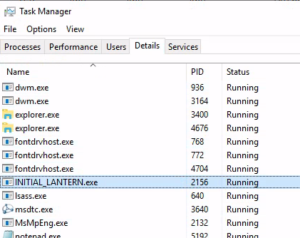<br>
    **Answer:** INITIAL_LANTERN.exe

1. What is the directory path where the malicious process is located?<br>
    Right-click to open file location.<br>
    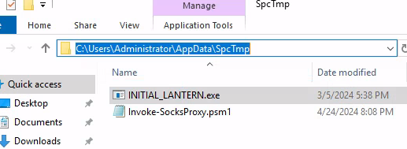<br>
    **Answer:** C:\Users\Administrator\AppData\SpcTmp

1. What is the remote port used by the malicious process?<br>
    Re-run tcp connection command.<br>
    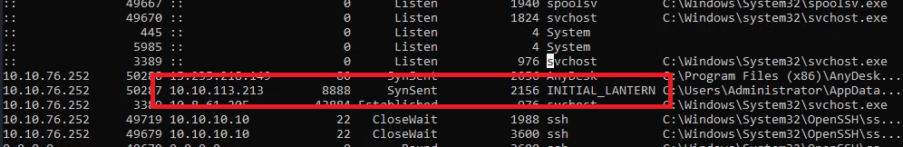<br>
    **Answer:** 8888

1. What is the full path of the suspicious program for AnyDesk? Enter your answer in a defanged format.<br>
    File `fw-rules.txt`. There is `AnyDesk.exe` which is not in default location.<br>
    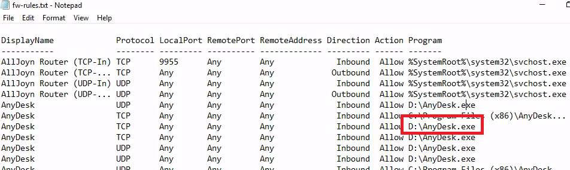<br>
    **Answer:** D:\AnyDesk[.]exe

1. What port is used by the LMV Co. firewall rules?<br>
    Also in `fw-rules.txt`.<br>
    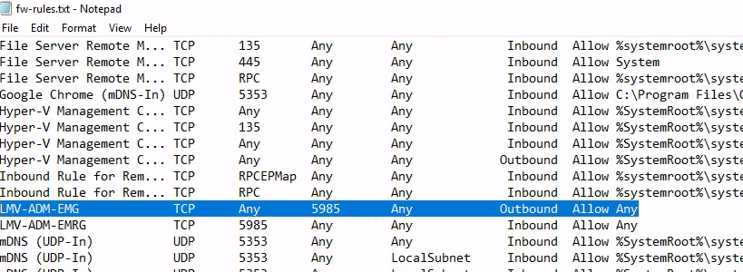<br>
    **Answer:** 5985

##  Task 8 - Background Activities I: Startup and Registry
1. Which user account will be used to run the AnyDesk application?<br>
    File `autorun-cmds.txt`.<br>
    ```
    Name     : RunWallpaperSetup
    command  : RunWallpaperSetup.cmd
    Location : Startup
    User     : CCTL-WS-018-B21\Guest

    Name     : AnyDesk
    command  : C:\PROGRA~2\AnyDesk\AnyDesk.exe  --control
    Location : Common Startup
    User     : Public

    Name     : SecurityHealth
    command  : %windir%\system32\SecurityHealthSystray.exe
    Location : HKLM\SOFTWARE\Microsoft\Windows\CurrentVersion\Run
    User     : Public
    ```
    **Answer:** Public

1. What is the value data stored in the "Userinit" key? Enter your answer in a defanged format.<br>
    From the last command, the value of `UserInit` is displayed.<br>
    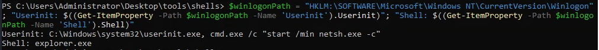<br>
    **Answer:** C:\Windows\system32\userinit.exe, cmd.exe /c "start /min netsh.exe -c"

1. What is the name of the suspicious DLL linked under the netshell hive key?<br>
    Run `reg query "HKLM\SOFTWARE\Microsoft\NetSh"` to see which dll is suspicious.<br>
    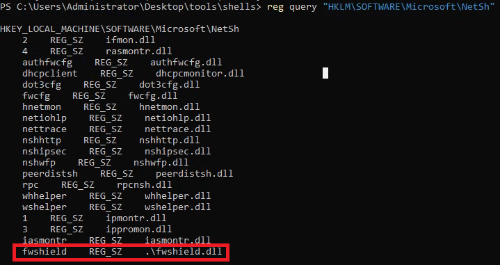<br>
    **Answer:** .\fwshield.dll

##  Task 9 - Background Activities II: Services and Scheduled Items
1. What is the name of the suspicious active service?<br>
    File `services-active.txt`. Service `LMVCSS` call to `C:\Users\Administrator\AppData\SpcTmp\INITIAL_LANTERN.exe`.<br>
    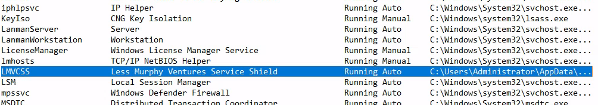<br>
    **Answer:** LMVCSS

2. What is the SHA256 value of the suspicious active service executable?<br>
    Use `certuti -hashfile` to calculate the sha256 of file.<br>
    **Answer:** e9aa7564b2d1d612479e193a9f8cb70df9cfbe02a39900eee22fe266f5320ebf

3. What is the name of the non-running service that caught our attention?<br>
    File `services-idle.txt`, the service `aurora-agent` is not the default service in Windows OS.<br>
    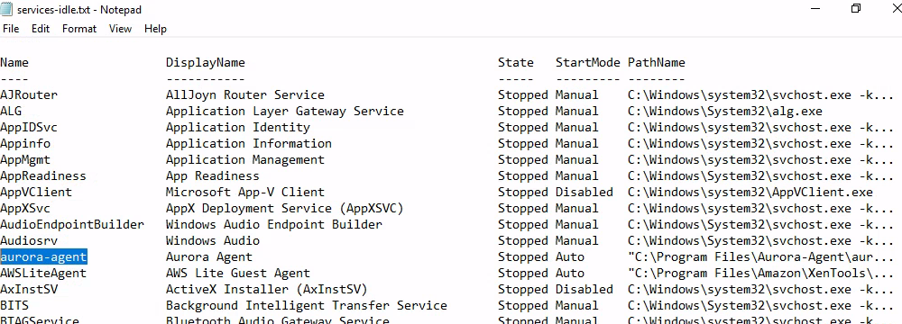<br>
    **Answer:** aurora-agent

4. What is the SHA256 value of the non-running service executable?<br>
    File `"C:\Program Files\Aurora-Agent\aurora-agent-64.exe"`.<br>
    **Answer:** d5c8bf2d3b56b21639d8152db277dd714ba1a61bdaf2350bd0ff7e61d2a99003

5. What is the original filename of the non-running service executable? Enter your answer in a defanged format.<br>
    Right-click on this file to see Properties of this, you will see the original file name.<br>
    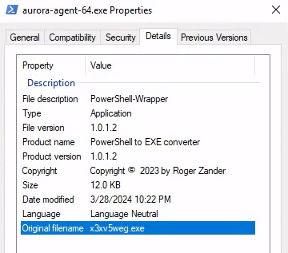<br>
    **Answer:** x3xv5weg[.]exe

##  Task 10 - Background Activities III: Processes and Directories
1. What is the parent process name of the suspicious executable (INITIAL_LANTERN) process? Enter your answer in a defanged format.<br>
    File `process-summary.txt`, the PPID of `INITIAL_LANTERN` is 608. It's `services.exe`
    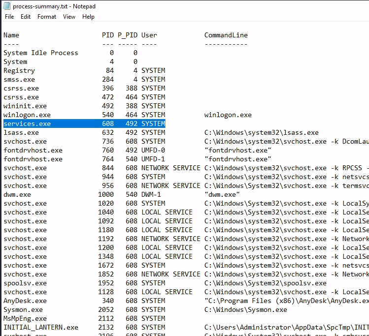<br>
    **Answer:** services[.]exe

1. Which user name is used for the SSH connection attempts?<br>
    Also in the above file, the ssh.exe connect to IP 10.10.10.10 with username james.<br>
    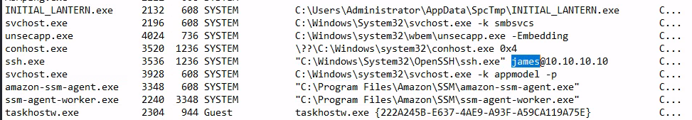<br>
    **Answer:** james

1. What is the parent process of the malicious aurora process? Enter your answer in a defanged format.<br>
    The malicious aurora process is `aurora-agent-64.exe` and the PPID is 944 which is svchost.exe.<br>
    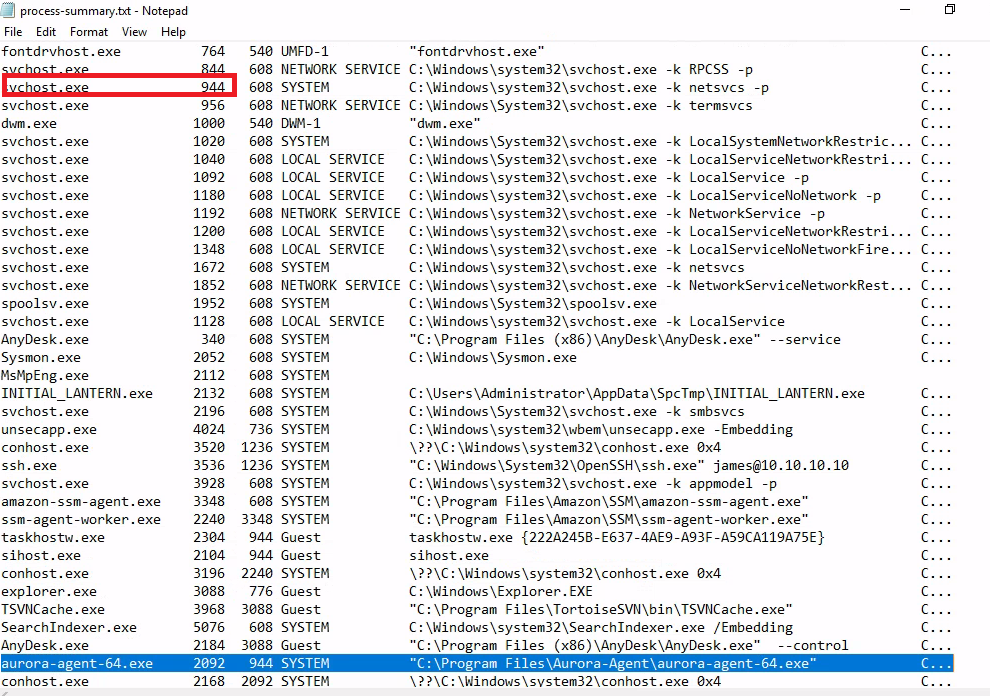<br>
    **Answer:** svchost[.]exe

1. What is the file name located in the default user's temp directory? Enter your answer in a defanged format.<br>
    File `temp-folders.txt`.<br>
    ```
    User          FullName                                         Name    Extension
    ----          --------                                         ----    ---------
    Administrator C:\Users\Administrator\AppData\Local\Temp\2      2                
    Administrator C:\Users\Administrator\AppData\Local\Temp\Low    Low              
    Default       C:\Users\Default\AppData\Local\Temp\jmp.exe      jmp.exe .exe     
    Default User  C:\Users\Default User\AppData\Local\Temp\jmp.exe jmp.exe .exe     
    Guest         C:\Users\Guest\AppData\Local\Temp\1              1
    ```
    **Answer:** jmp[.]exe

1. What is the name of the potential proxy script located in the suspicious non-default temp folder? Enter your answer in a defanged format.<br>
    The script located in the same folder with `INITIAL_LANTERN`.<br>
    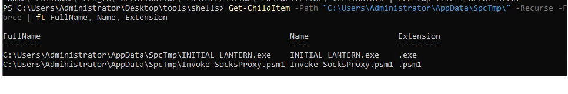<br>
    **Answer:** Invoke-SocksProxy[.]psm1

1. What is the SHA256 value of the potential proxy script located in the suspicious non-default temp folder?<br>
    **Answer:** e7697645f36de5978c1b640b6b3fc819e55b00ee8d9e9798919c11cc7a6fc88b

1. What is the label of the hidden disc volume?<br>
    File `disc-volumes.txt` display all volume in computer, but the volume `Setups` does not have label, so it will hidden when view in explorer.<br>
    ```
    DriveLetter Label  FileSystem    Capacity   FreeSpace
    ----------- -----  ----------    --------   ---------
    C:                 NTFS       33282846720 13335506944
                Setups NTFS        1073737728  1007841280
    ```
    **Answer:** Setups
