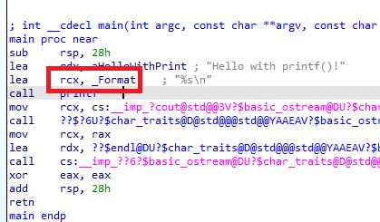
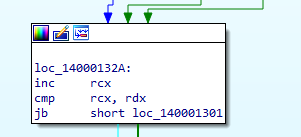

> # Windows Reversing Intro

## Task 3 - Explanation Function Prologue/Epilogue
Prologue - Phần mở đầu function 
Không gian phân bố cho stack frame bằng cách trừ cho thanh ghi RSP, giá trị bị trừ có thể xác định được có bao nhiêu tham số của function. 

## Task 4 - Analysis Function Call Sample
1. In the HelloWorld.exe sample, which instruction sets up the first parameter for the call to printf()? Provide the full instruction as shown in IDA, with single spaces. Example: mov RAX, RBX 
    Open IDA and load the HelloWorld.exe to it, in `main` function and the instruction before `call printf`, you will the `lea` load _Format to rcx. 
     
    **Answer:** lea rcx, _Format

## Task 5 - Analysis Loop Sample
1. In the Loop.exe sample, what instruction is the key to finding out what register is the counter? Provide the full instruction as shown in IDA, with single spaces. For example: dec RAX 
    RCX register is increase for each round of loop and compare with rdx. 
     
    **Answer:** inc rcx

