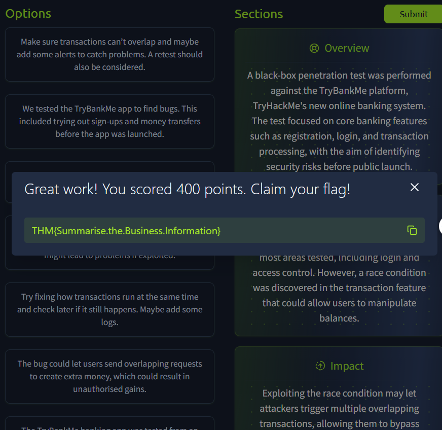
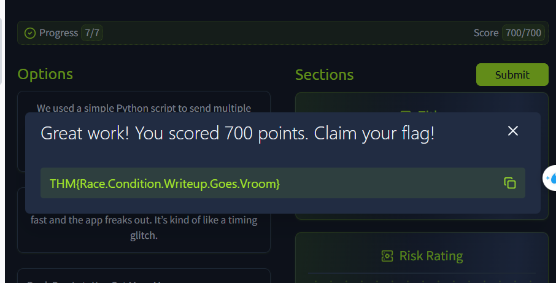
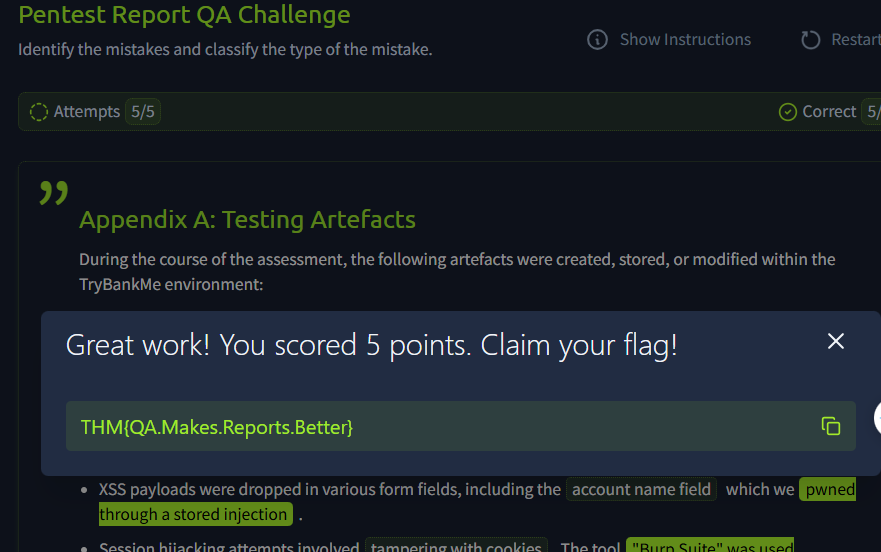

> # Writing Pentest Reports

## Summary
- [Summary](#summary)
  - [Task 2 - The Anatomy of a Pentest Report](#task-2---the-anatomy-of-a-pentest-report)
  - [Task 3 - Report Section 1: Summary](#task-3---report-section-1-summary)
  - [Task 4Report Section 2: Vulnerability Write-Ups](#task-4report-section-2-vulnerability-write-ups)
  - [Task 5 - Report Section 3: Appendices](#task-5---report-section-3-appendices)
  - [Task 6 - Styling Guides and Report QA](#task-6---styling-guides-and-report-qa)

### Task 2 - The Anatomy of a Pentest Report
1. Which stakeholder should 80% of your report be aimed towards? 
    > Technical Stakeholders: As this is the most crucial audience, you would usually find that around 70-90% of your report is specifically aimed towards this audience.

    **Answer:** Technical

1. Which section of the report is for extra information that can sometimes help security stakeholders better understand what coverage was achieved and the next steps that should be followed? 
    > Appendices: The appendices provide supporting details that don’t fit in the main report. This could include elements such as the detailed testing scope, methodology, or artefacts that were left over from testing. These appendices are usually used by the security stakeholders to help them better understand the coverage that was achieved during the engagement and the next steps that would be required once remediation has been performed.

### Task 3 - Report Section 1: Summary
1. What is the value of the flag? 
     
    **Answer:** THM{Summarise.the.Business.Information}

### Task 4Report Section 2: Vulnerability Write-Ups
1. What is the flag? 
     
    **Answer:** THM{Race.Condition.Writeup.Goes.Vroom}

### Task 5 - Report Section 3: Appendices
1. Which appendix will be vital for the blue team to discern if activity is from a pentest or an actual attack? 
    **Answer:** Assessment Artefacts

### Task 6 - Styling Guides and Report QA
1. What is the value of the flag? 
     
    **Answer:** THM{QA.Makes.Reports.Better}
