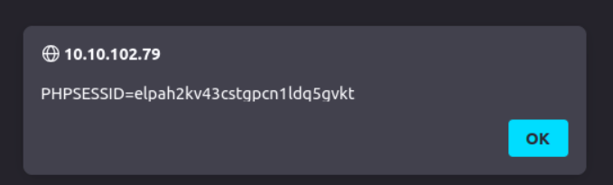

> # XSS

## Summary
- [Summary](#summary)
  - [Task 2 - Terminology and Types](#task-2---terminology-and-types)
  - [Task 3 - Causes and Implications](#task-3---causes-and-implications)
  - [Task 4 - Reflected XSS](#task-4---reflected-xss)
  - [Task 5 - Vulnerable Web Application 1](#task-5---vulnerable-web-application-1)
  - [Task 6 - Stored XSS](#task-6---stored-xss)
  - [Task 7 - Vulnerable Web Application 2](#task-7---vulnerable-web-application-2)
  - [Task 8 - DOM-Based XSS](#task-8---dom-based-xss)
  - [Task 9 - Context and Evasion](#task-9---context-and-evasion)
  - [Task 10 - Conclusion](#task-10---conclusion)

### Task 2 - Terminology and Types
1. Which XSS vulnerability relies on saving the malicious script? 
    > Stored XSS: This attack relies on the user input stored in the website’s database. For example, if users can write product reviews that are saved in a database (stored) and being displayed to other users, the attacker would try to insert a malicious script in their review so that it gets executed in the browsers of other users.

    **Answer:** Stored XSS

1. Which prevalent XSS vulnerability executes within the browser session without being saved? 
    > Reflected XSS: This attack relies on the user-controlled input reflected to the user. For instance, if you search for a particular term and the resulting page displays the term you searched for (reflected), the attacker would try to embed a malicious script within the search term.

    **Answer:** Reflected XSS

1. What does DOM stand for? 
    > DOM-based XSS: This attack exploits vulnerabilities within the Document Object Model (DOM) to manipulate existing page elements without needing to be reflected or stored on the server. This vulnerability is the least common among the three.

    **Answer:** Document Object Model

### Task 3 - Causes and Implications
1. Based on the leading causes of XSS vulnerabilities, what operations should be performed on the user input? 
    **Answer:** validation and sanitization

1. To prevent XSS vulnerabilities, what operations should be performed on the data before it is output to the user? 
    **Answer:** encoding

### Task 4 - Reflected XSS
1. Which one of the following characters do you expect to be encoded? ., ,, ;, &, or #? 
    **Answer:** &

1. Which one of the following characters do you expect to be encoded? +, -, *, <, =, or ^? 
    **Answer:** <

1. Which function can we use in JavaScript to replace (unsafe) special characters with HTML entities? 
    > the escapeHtml() function aims to escape characters such as <, >, &, ", and '

    **Answer:** escapeHtml()

1. Which function did we use in PHP to replace HTML special characters? 
    **Answer:** htmlspecialchars()

### Task 5 - Vulnerable Web Application 1
1. What type of vulnerability is it? 
    **Answer:** Reflected XSS

1. Use the above exploit against the attached VM. What do you see on the second line after go to? 
    URL: `http://10.10.224.238:3923/?k304=y%0D%0A%0D%0A%3Cimg+src%3Dcopyparty+onerror%3Dalert(1)%3E` 
     
    **Answer:** ?h#cc

### Task 6 - Stored XSS
1. What is the name of the JavaScript function we used to sanitize the user input before saving it? 
    **Answer:** sanitizeHtml()

1. Which method did we call in ASP.Net C# to sanitize user input? 
    **Answer:** HttpUtility.HtmlEncode()

### Task 7 - Vulnerable Web Application 2
1. What type of vulnerability is it? 
    **Answer:** Stored XSS

1. Go to the contact page and submit the following message . Next, log in as the Receptionist. What is the name of the key from the displayed key-value pair? 
     
    **Answer:** PHPSESSID

### Task 8 - DOM-Based XSS
1. DOM-based XSS is reflected via the server. (Yea/Nay) 
    > The reason is that DOM-based XSS is completely browser-based and does not need to go to the server and back to the client.

    **Answer:** Nay

1. DOM-based XSS happens only on the client side. (Yea/Nay) 
    **Answer:** Yea

1. Which JavaScript method was used to escape the user input? 
    **Answer:** encodeURIComponent()

### Task 9 - Context and Evasion
1. Which character does &#x09 represent? 
    > Horizontal tab (TAB) is 9 in hexadecimal representation

    **Answer:** TAB

### Task 10 - Conclusion
1. This room used a fictional static site to demonstrate one of the XSS vulnerabilities. Which XSS type was that? 
    **Asnwer:** DOM-based XSS
