> # h4cked - Tryhackme

# Summary
* [Task 1 - Oh no! We've been hacked!](#task-1---oh-no-weve-been-hacked)
* [Task 2 - Hack your way back into the machine](#task-2---hack-your-way-back-into-the-machine)

## Task 1 - Oh no! We've been hacked!
1. The attacker is trying to log into a specific service. What service is this?<br>
    Open the attachmented file, you'll see the IP address 192.168.0.147 sends a lot of requests to port 21 whose service is FTP.<br>
    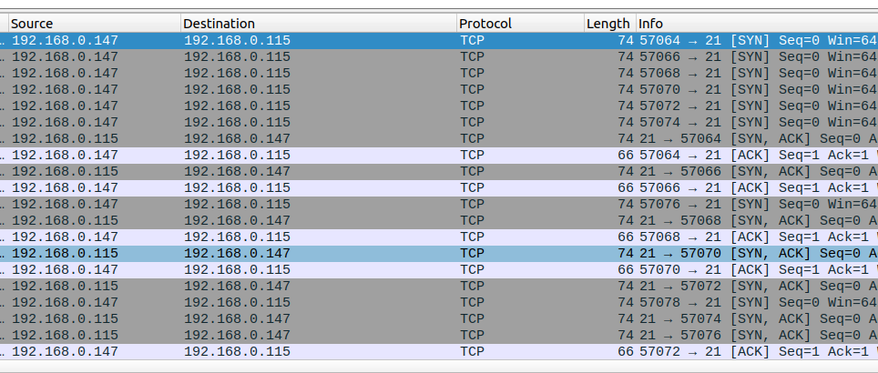<br>
    **Answer:** FTP

1. There is a very popular tool by Van Hauser which can be used to brute force a series of services. What is the name of this tool?<brb>
    Research on Google with the given name, you will see his/her github account with a repo named thc-hydra.<br>
    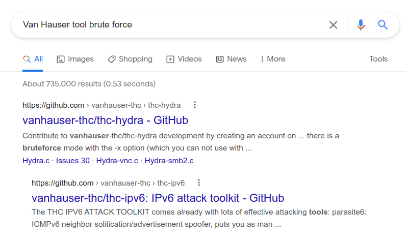<br>
    **Answer:** hhydra

1. The attacker is trying to log on with a specific username. What is the username?<br>
    Filter FTP protocol, all username is `jenny`.<br>
    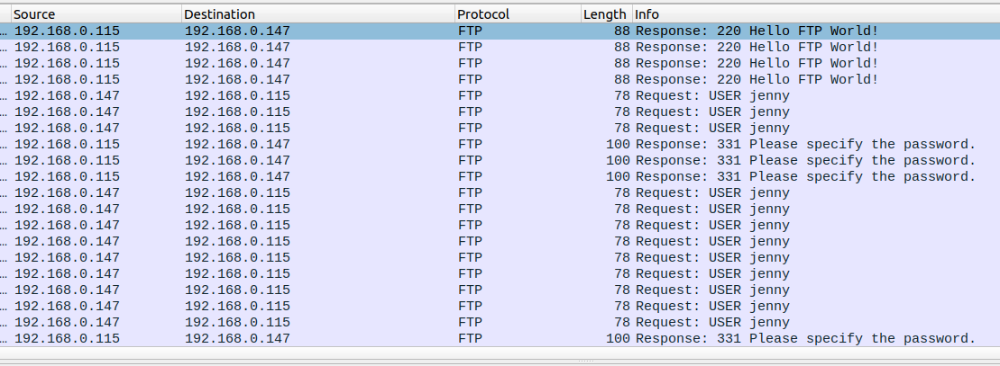<br>
    **Answer:** jenny

1. What is the user's password?<br>
    When the given password is correct, the FTP server responsed a message `Login Successfull`, so I filtered this string on Wireshark.<br>
    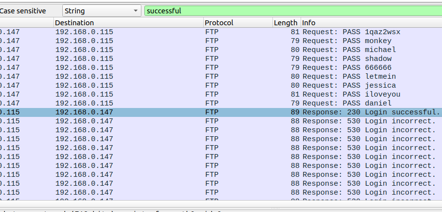<br>
    But we don't know what the correct password is. Thus, I follow `TCP Stream` to find it.<br>
    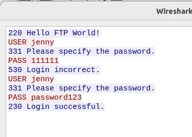<br>
    **Answer:** password123

1. What is the current FTP working directory after the attacker logged in?<br>
    To display current working directory in FTP cli, the `PWD` command was used. Therefore, I search with this string.<br>
    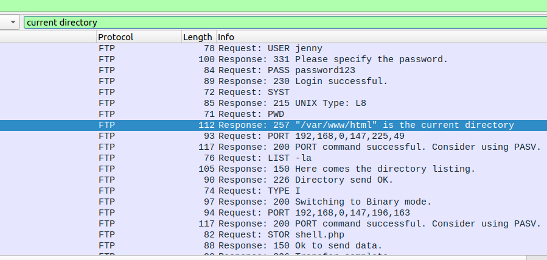<br>
    **Answer:** /var/www/html

1. The attacker uploaded a backdoor. What is the backdoor's filename?<br>
    Follow TCP Stream of session which successfully login to FTP. You'll see all activities of attacker on the server.<br>
    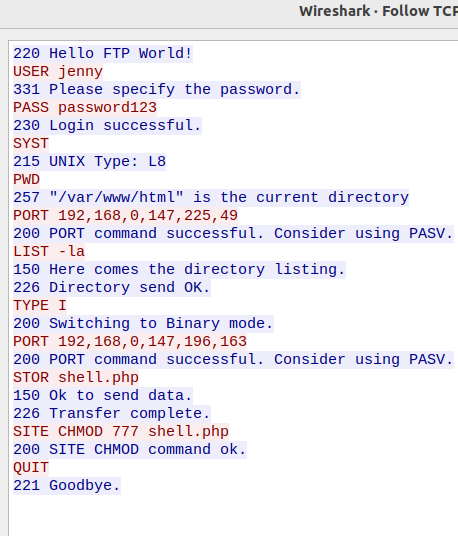<br>
    The file `shell.php` was uploaded to the server.
    **Answer:** shell.php

1. The backdoor can be downloaded from a specific URL, as it is located inside the uploaded file. What is the full URL?<br>
    Filter `FTP-DATA` protocol to view content of shell.php, you will see the link where this backdoor was downloaded.<br>
    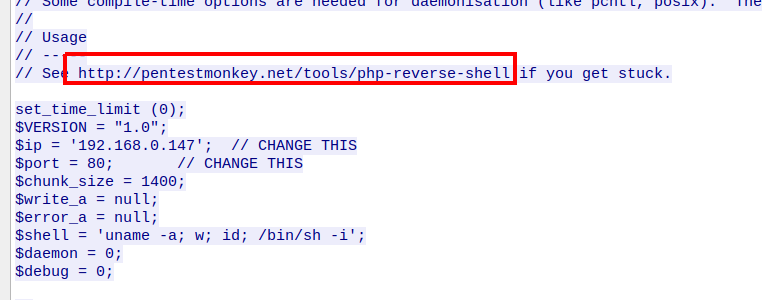<br>
    **Answer:** http://pentestmonkey.net/tools/php-reverse-shell

1. Which command did the attacker manually execute after getting a reverse shell?<br>
    Follow TCP Stream at 20th stream.<br>
    After getting a RCE, attacker execute `whoami` command first.<br>
    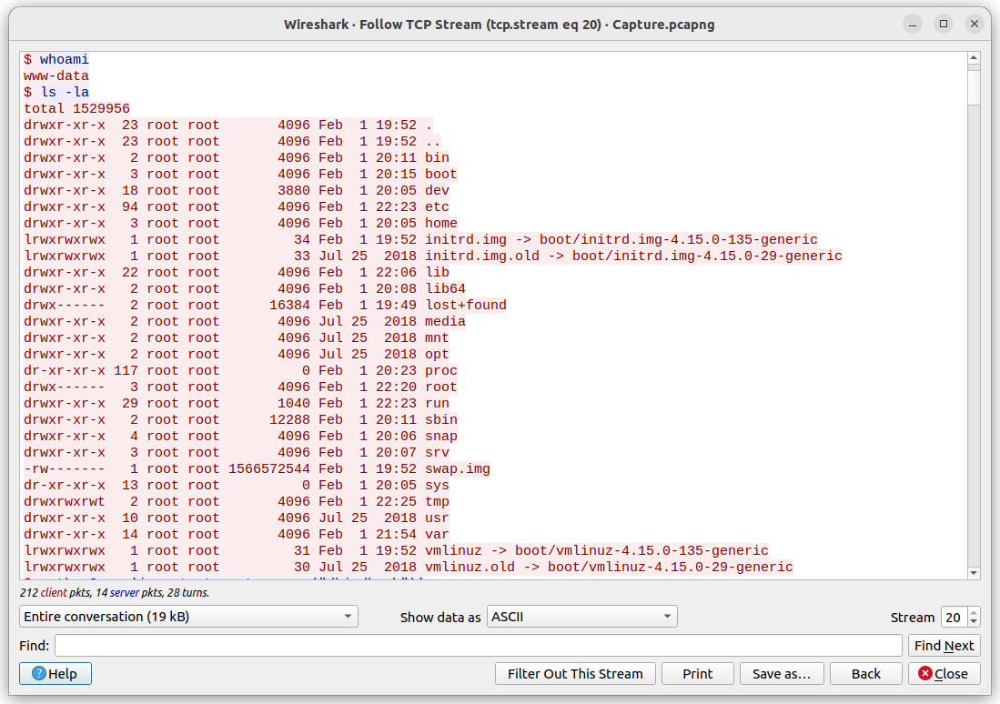<br>
    **Answer:** whoami

1. What is the computer's hostname?<br>
    After getting stable shell with `pty` module in python, the computer's hostname is display.<br>
    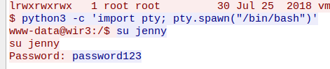<br>
    **Answer:** wir3

1. Which command did the attacker execute to spawn a new TTY shell?<br>
    From previous image, we have already had the answer.<br>
    **Answer:** python3 -c 'import pty; pty.spawn("/bin/bash")'

1. Which command was executed to gain a root shell?<br>
    Scroll down.<br>
    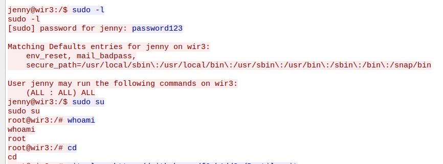<br>
    **Answer:** sudo su

1. The attacker downloaded something from GitHub. What is the name of the GitHub project?<br>
    Keep going scroll down.<br>
    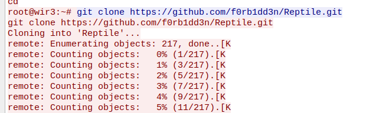<br>
    **Answer:** Reptile

1. The project can be used to install a stealthy backdoor on the system. It can be very hard to detect. What is this type of backdoor called?<br>
    Follow this repo, you will see the warning.<br>
    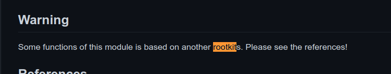<br>
    **Answer:** rootkit

## Task 2 - Hack your way back into the machine
Find the jenny's password first with hydra and rockyou.txt.<br>
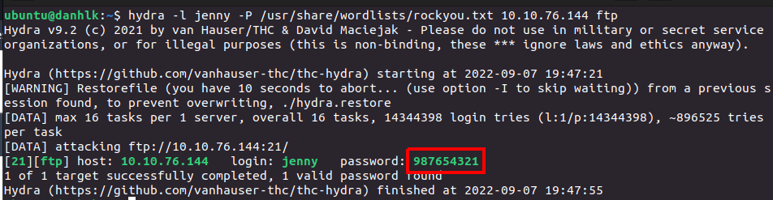<br>
Use php reverse shell from the link above and change the IP address into your private IP when connect to Tryhackme using OpenVPN.<br>
Upload this shell to ftp server.<br>
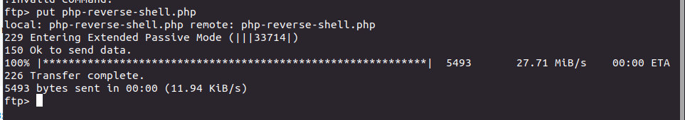<br>
Create your listener with netcat on port assigning before.<br>
```
$ nc -lvnp 4444
Listening on 0.0.0.0 4444
```
Navigate to http://{IP}/php-reverse-shell.php to trigger reverse shell.<br>
If it doesn't give you the shell, you have to enable excutable to this file with `chmod 777 php-reverse-shell.php`<br>
Now, it'll give you the shell.<br>
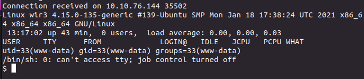<br>
Become root and get flag.<br>
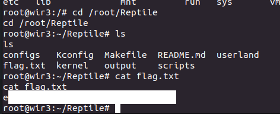<br>
**Answer:** practice make perfect

