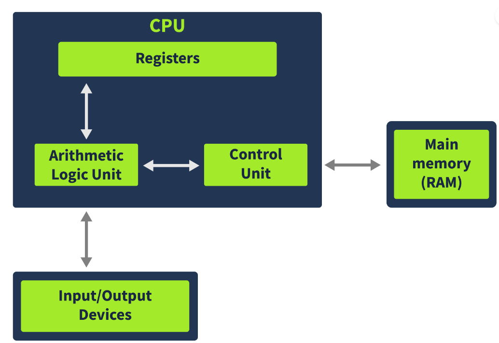
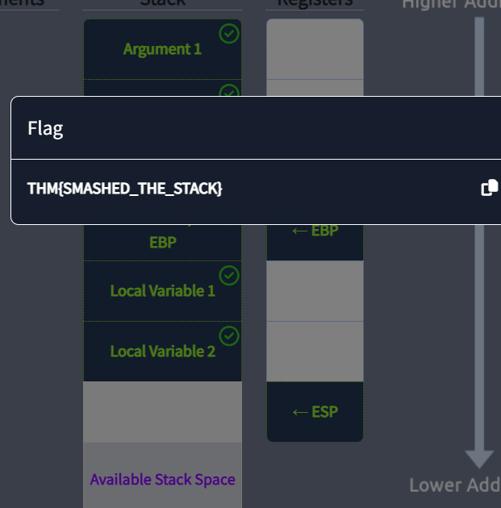

> # x86 Architecture Overview

# Summary
<!-- TOC -->

- [Summary](#summary)
    - [Task 2 - CPU architecture overview](#task-2---cpu-architecture-overview)
    - [Task 3 - Registers overview](#task-3---registers-overview)
    - [Task 4 - Registers - Continued](#task-4---registers---continued)
    - [Task 5 - Memory overview](#task-5---memory-overview)
    - [Task 6 - Stack Layout](#task-6---stack-layout)

<!-- /TOC -->

## Task 2 - CPU architecture overview
 

1. In which part of the Von Neumann architecture are the code and data required for a program to run stored? 
    > The Memory, also called Main Memory or Random Access Memory (RAM), contains all the code and data for a program to run. When a user executes a program, its code and data are loaded into the Memory, from where the CPU one instruction accesses it at a time.

    **Answer:** Memory

1. What part of the CPU stores small amounts of data? 
    > The Registers are the CPU's storage. Registers are generally much smaller than the Main Memory, which is outside the CPU, and help save time in executing instructions by placing important data in direct access to the CPU.

    **Answer:** Register

1. In which unit are arithmetic operations performed? 
    > The arithmetic logic unit executes the instruction fetched from the Memory. The results of the executed instruction are then stored in either the Registers or the Memory.

    **Answer:** arithmetic logic unit

## Task 3 - Registers overview
1. Which register holds the address to the next instruction that is to be executed? 
    > The Instruction Pointer is a register that contains the address of the next instruction to be executed by the CPU.

    **Answer:** Instruction Pointer

1. Which register in a 32-bit system is also called the Counter Register? 
    > ECX or RCX: This register is also called the Counter Register and is often used in counting operations such as loops, etc.

    **Answer:** ecx

1. Which registers from the ones discussed above are not present in a 32-bit system? 
    > R8-R15: These 64-bit general-purpose registers are not present in 32-bit systems.

    **Answer:** R8-R15

## Task 4 - Registers - Continued
1. Which flag is used by the program to identify if it is being run in a debugger? 
    > The Trap Flag or TF indicates if the processor is in debugging mode.

    **Answer:** Trap Flag

1. Which flag will be set when the most significant bit in an operation is set to 1? 
    > The Sign Flag or SF indicates if the result of an operation is negative or the most significant bit is set to 1.

    **Answer:** Sign Flag

1. Which Segment register contains the pointer to the code section in memory? 
    > Code Segment: The Code Segment (CS ) register points to the Code section in the memory.

    **Answer:** Code Segment

## Task 5 - Memory overview
1. When a program is loaded into Memory, does it have a full view of the system memory? Y or N? 
    > This means that the program doesn't have access to the full Memory; instead, it only has access to its Memory. 

    **Answer:** N

1. Which section of the Memory contains the code?    
    **Answer:** Code

1. Which Memory section contains information related to the program's control flow? 
    > Stack: Since the return address is related to the control flow of the CPU's instructions, the stack is often targeted by malware to hijack the control flow.

    **Answer:** Stack

## Task 6 - Stack Layout
1. Follow the instructions in the attached static site and find the flag. What is the flag? 
     
    **Answer:** THM{SMASHED_THE_STACK}

